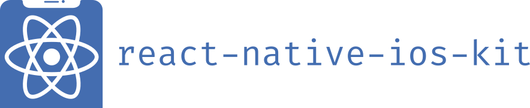

<p align="center">
  
</p>
</br>
<p align="center">
  The missing React Native UI Kit for iOS.
</p>

---


[![Version][version-badge]][package]
[![MIT License][license-badge]][license]

[![PRs Welcome][prs-welcome-badge]][prs-welcome]
[![Chat][chat-badge]][chat]
[![tweet][tweet-badge]][tweet]
[![Sponsored by Callstack][callstack-badge]][callstack]

## Features

You can find documentation with all list of features and components [here](https://callstack.github.io/react-native-ios-kit)

## Try it out

```sh
cd example && npm run ios
```

or run the [example app](https://expo.io/@mobile-dev/react-native-ios-kit) with [Expo](https://expo.io/) to see it in action.

## Getting Started

### Installation

Open a Terminal in your project's folder and run

```sh
  yarn add react-native-ios-kit react-native-vector-icons
```

After installation, you'll need to link [react-native-vector-icons](https://github.com/oblador/react-native-vector-icons).

### Usage

Wrap your root component in **ThemeProvider** from **react-native-ios-kit**.

It's a good idea to wrap the component which is passed to **AppRegistry.registerComponent**.

Example:

```javascript
import * as React from 'react';
import { AppRegistry } from 'react-native';
import { ThemeProvider } from 'react-native-ios-kit';
import App from './src/App';

function Main() {
  return (
    <ThemeProvider>
      <App />
    </ThemeProvider>
  );
}

AppRegistry.registerComponent('main', () => Main);
```

The **ThemeProvider** component provides the theme to all the components in the framework. It also acts as a portal to components which need to be rendered at the top level.

### Customization

#### Main theme for application

You can provide a custom theme to customize the colors, fonts etc. with the **ThemeProvider** component.
Check the [Theme Type](https://callstack.github.io/react-native-ios-kit/docs/theme.html) to see what customization options are supported.

Example:

```javascript
import * as React from 'react';
import { AppRegistry } from 'react-native';
import { DefaultTheme, ThemeProvider } from 'react-native-ios-kit';
import color from 'color';
import App from './src/App';

const theme = {
  ...DefaultTheme,
  primaryColor: 'tomato',
  primaryLightColor: color('tomato')
    .lighten(0.2)
    .rgb()
    .string(),
  disabledColor: 'yellow',
};

function Main() {
  return (
    <ThemeProvider theme={theme}>
      <App />
    </ThemeProvider>
  );
}
```

#### Customization per component

You can also customize theme per one component by using `theme` prop.

Example:

```javascript
  <Icon
    name="ios-people"
    theme={{
      primaryColor: 'green'
    }}
  >
```

This code will change icon color to `green`

## Documentation

Check the components and their usage in our [documentation](https://callstack.github.io/react-native-ios-kit).

## Contributing

Read the [contribution guidelines](/CONTRIBUTING.md) before contributing.

## Made with ❤️ at Callstack

`react-native-ios-kit` is an open source project and will always remain free to use. If you think it's cool, please star it 🌟. [Callstack](callstack-readme-with-love) is a group of React and React Native geeks, contact us at [hello@callstack.com](mailto:hello@callstack.com) if you need any help with these or just want to say hi!

<!-- badges -->

[build-badge]: (https://github.com/callstack/react-native-ios-kit/workflows/Build%20and%20test/badge.svg)
[version-badge]: https://img.shields.io/npm/v/react-native-ios-kit.svg?style=flat-square
[package]: https://www.npmjs.com/package/react-native-ios-kit
[license-badge]: https://img.shields.io/npm/l/react-native-ios-kit.svg?style=flat-square
[license]: https://opensource.org/licenses/MIT
[chat-badge]: https://img.shields.io/discord/426714625279524876.svg?style=flat-square&colorB=758ED3
[chat]: https://discord.gg/zwR2Cdh
[tweet-badge]: https://img.shields.io/badge/tweet-%23react--native--ios--kit-blue.svg?style=flat-square&colorB=1DA1F2&logo=data:image/png;base64,iVBORw0KGgoAAAANSUhEUgAAABgAAAAUCAYAAACXtf2DAAAAAXNSR0IArs4c6QAAAaRJREFUOBGtlM8rBGEYx3cWtRHJRaKcuMtBSitxkCQ3LtzkP9iUUu5ODspRHLhRLtq0FxeicEBC2cOivcge%2FMgan3fNM8bbzL4zm6c%2BPT%2Fe7%2FO8887svrFYBWbbtgWzsAt3sAcpqJFxxF1QV8oJFqFPFst5dLWQAT87oTgPB7DtziFRT1EA4yZolsFkhwjGYFRO8Op0KD8HVe7unoB6PRTBZG8IctAmG1xrHcfkQ2B55sfI%2ByGMXSBqV71xZ8CWdxBxN6ThFuECDEAL%2Bc9HIzDYumVZ966GZnX0SzCZvEqTbkaGywkyFE6hKAsBPhFQ18uPUqh2ggJ%2BUor%2F4M%2F%2FzOC8g6YzR1i%2F8g4vvSI%2ByD7FFNjexQrjHd8%2BnjABI3AU4Wl16TuF1qANGll81jsi5qu%2Bw6XIsCn4ijhU5FmCJpkV6BGNw410hfSf6JKBQ%2FUFxHGYBnWnmOwDwYQ%2BwzdHqO75HtiAMJfaC7ph32FSRJCENUhDHsLaJkL%2FX4wMF4%2BwA5bgAcrZE4sr0Cu9Jq9fxyrvBHWbNkMD5CEHWTjjT2m6r5D92jfmbbKJEWuMMAAAAABJRU5ErkJggg%3D%3D
[tweet]: https://twitter.com/intent/tweet?text=Check%20out%20react-native-ios-kit!%20https://github.com/callstack/react-native-ios-kit%20%F0%9F%91%8D
[callstack]: https://callstack.com/open-source/?utm_source=github.com&utm_medium=referral&utm_campaign=react-native-ios-kit&utm_term=readme-badge
[callstack-readme-with-love]: https://callstack.com/?utm_source=github.com&utm_medium=referral&utm_campaign=react-native-ios-kit&utm_term=readme-with-love
[callstack-badge]: https://callstack.com/images/callstack-badge.svg
[prs-welcome-badge]: https://img.shields.io/badge/PRs-welcome-brightgreen.svg?style=flat-square
[prs-welcome]: http://makeapullrequest.com
