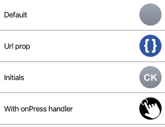

Avatar component.



Example usage:
```javascript
<Avatar initials="CK" size={30} />
```

## Props

### `initials` (optional)  
**type:** `string`  

String to be displayed inside Avatar. 
Defaults to empty string.

### `onPress` (optional)
**type:** `void => void`  

onPress event handler.

### `size` (optional)
**type:** `number`

Size of an Avatar.

### `style` (optional)
**type:** `Object`  

Custom styles to apply to Avatar.

### `theme` (optional)
**type:** [`Theme`](theme.html)

Custom theme for component. By default provided by the ThemeProvider.

### `url` (optional)
**type:** `string`

Url pointing to remote avatar image.
