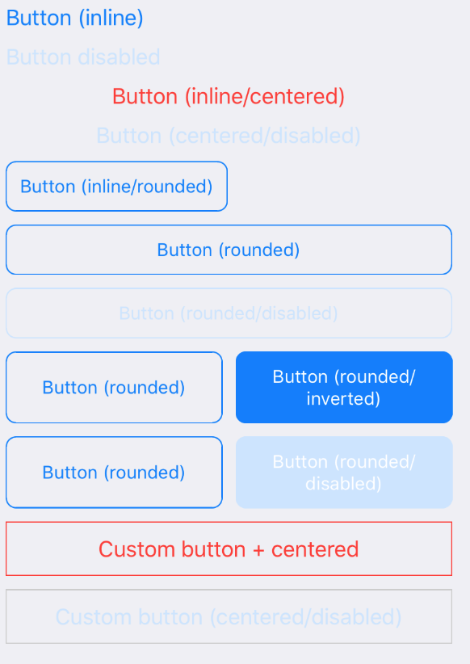

A basic Button component.



Example usage:
```javascript
<Button style={styles.button} inline rounded>
  Button (inline/rounded)
</Button>
```

## Props

### `color` (optional)
type: `string`  

Custom font color.

### `disabled` (optional)
type: `boolean`  

If true, disable all interactions for this component.

### `inline` (optional)
type: `boolean`  

If true, disable automatic horizontal resize.
The button will only occupy width it needs, instead of 100%.

### `centered` (optional)
type: `boolean`  

If true, center text inside the button.
Applies only if rounded prop is not true.

### `rounded` (optional)
type: `boolean`  

If true, make border corners rounded.

### `inverted` (optional)
type: `boolean`  

If true, invert font color with background color.
Applies only if rounded prop is true.

### `onPress` (optional)
type: `Function`  

Handler to be called when the user taps the button.

### `onPressIn` (optional)
type: `Function`  

Called as soon as the touchable element is pressed and invoked even before onPress.

### `onPressOut` (optional)
type: `Function`  

Called as soon as the touch is released even before onPress.

### `onLongPress` (optional)
type: `Function`  

Called on a long press.

### `style` (optional)
type: `Object`  

Custom styles to apply to the button.

### `innerStyle` (optional)
type: `Object`  

Custom styles to apply to text inside the button.

### `disabledStyle` (optional)
type: `Object`  

Custom styles to apply to the button.

### `theme` (optional)
type: [`Theme`](theme.html)

Custom theme for component. By default provided by the ThemeProvider.

### `children` (optional)
type: `React.Element<*> | React.Element<*>[] | string`


