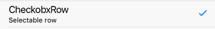

RowItem with Checkmark Icon on right side.



Example usage:
```jsx
import { CheckboxRow } from 'react-native-ios-kit';

<CheckboxRow
  selected={this.state.checkboxSelected}
  onPress={() =>
    this.setState(state => ({
      checkboxSelected: !state.checkboxSelected,
    }))
  }
  title="CheckboxRow"
  subtitle="Selectable row"
/>
```

## Theme
Uses following `theme` properties:
- `primaryColor` - checkmark icon color


## Props

### [RowItem props...](row-item.html#props)

Other props accepted by `RowItem` component.

### `onPress`
**type:** `void => void`

Event fired when Row is pressed in.

### `selected`
**type:** `boolean`

Indicates whether checkbox is selected or not.

### `theme` (optional)
**type:** [`Theme`](theme.html)

Custom theme for component. By default provided by the ThemeProvider.
