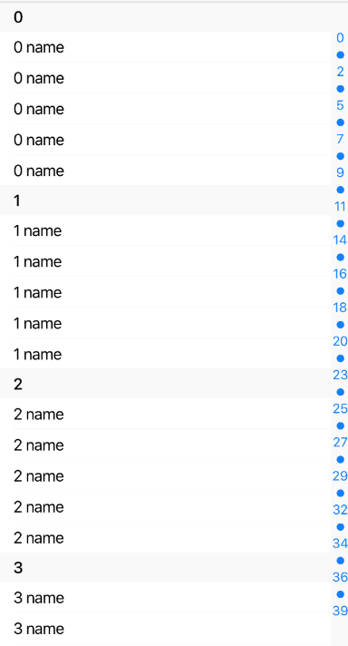

Simple GroupedList component with customizable section list on the right.
It simulates iOS contact list.



Example usage: 
```jsx
<GroupedList
  sections={['a','b','c','d','e']}
  renderItem={({ item }) => (
    <View style={styles.item}>
      <Body>{item.name}</Body>
    </View>
  )}
  renderSectionHeader={({ section }) => <Title2>{section.title}</Title2>}
  groupBy={(item: Item) => item.group}
/>
```

>**Note:** To make it possible to scroll to every section this component will render all data at the beggining. To change that use `getItemLayout` prop!

## Theme
Uses following `theme` properties:
- `barColor` - separator color, default section header background color, sections background color
- `primaryColor` - section text color

## Props

### `getItemLayout` (optional)
**type:** `(data: any, index: number) => { length: number, offset: number, index: number}`

`getItemLayout` is an optional optimization that let us skip measurement of dynamic content if you know the height of items a priori. getItemLayout is the most efficient, and is easy to use if you have fixed height items. For more information see react-native [docs](https://facebook.github.io/react-native/docs/flatlist.html#getitemlayout).

### `groupBy`
**type:** `(item: any) => string`

Using this function you can specify how to group your data.

### `items`
**type:** `Array<any>`

Data to be displayed in list.

### `ItemSeparatorComponent`
**type:** `React.ComponentType<*>`

Rendered in between each item, but not at the top or bottom.

### `renderItem`
**type:** `(data: { item: *, index: number }) => ?React.Element<*>`

Default renderer for every item in every section. Can be over-ridden on a per-section basis. Should return a React element.

### `renderSectionFooter` (optional)
**type:** `(data: {section: { title: string }}) => ?React.Element<*>`

Rendered at the bottom of each section.

### `renderSectionHeader` (optional)
**type:** `(data: { section: { title: string } }) => ?React.Element<*>`

Rendered at the top of each section. These stick to the top of the ScrollView by default. You can disable it using `stickySectionHeadersEnabled` prop.

### `stickySectionHeadersEnabled` (optional)
**type:** `boolean`   
**default value:** `true`

Makes section headers stick to the top of the screen until the next one pushes it off. 

### `sections` (optional)
**type:** `Array<string>`   
**default value:** `['A', 'B', 'C', 'D', 'E', ...]`

Array with all sections. By default all letters of english aplphabet.

### `sectionPrimaryColor` (optional)
**type:** `string`   
**default value:**: `primaryColor` from ThemeProvider

Sections text color.

### `SectionSeparatorComponent` (optional)
**type:** `React.ComponentType<*>`

Rendered at the top and bottom of each section (note this is different from ItemSeparatorComponent which is only rendered between items). These are intended to separate sections from the headers above and below and typically have the same highlight response as ItemSeparatorComponent.

### `sectionsStyle` (optional)
**type:** `StyleObj`

Styles to apply on section list.

### `theme` (optional)
**type:** [`Theme`](theme.html)

Custom theme for component. By default provided by the ThemeProvider.

