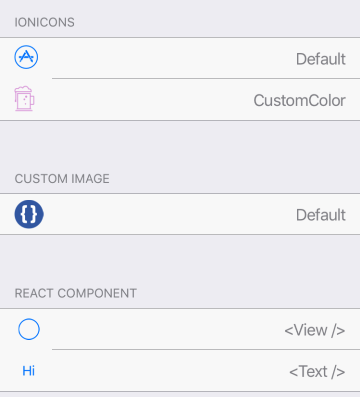

Icon component.



Example usage: 
```jsx
<Icon
  name={'ios-paper-outline'}
  size={30}
  color={'blue'}
/>
```

## Props

### `name`
type: `string`

Icon name, one of [Ionicons](https://github.com/oblador/react-native-vector-icons/blob/master/glyphmaps/Ionicons.json)

### `color` (optional)
type: `string`

Custom color for icon, default to Theme's `primaryColor`

### `size` (optional)
type: `number`

Icon size, defaults to 50

### `style` (optional)
type: `Object`

Custom styles to apply to the Icon

### `theme` (optional)
type: [`Theme`](theme.html)

Custom theme for component. By default provided by the ThemeProvider.

