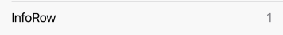

Basic Row to display additional information on right side.




Example usage:
```jsx
import { InfoRow } from 'react-native-ios-kit';

<InfoRow title="InfoRow" info="1" />
```

## Theme
Uses following `theme` properties:
- `placeholderColor` - color of info string.

## Props

### [RowItem props...](row-item.html#props)

Other props accepted by `RowItem` component.

### `info`
**type** `string`

Information to be displayed at right side of row.

### `theme` (optional)
**type:** [`Theme`](theme.html)

Custom theme for component. By default provided by the ThemeProvider.
