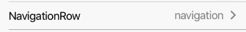

RowItem with information and RightArrow Icon on right side.


 
Example usage:
```jsx
<NavigationRow
  title="NavigationRow"
  onPress={() => alert('NavigationRow pressed')}
  info="navigation"
/>
```

## Props

### [RowItem props...](row-item.html#props)

Other props accepted by `RowItem` component

### `info` (optional)  
**type:** string

Additional information to be displayed next to RightArrow Icon.

### `onPress`
**type:** `(value: boolean) => *`

`onPress` event fired when user presses Row.

### `theme` (optional)
**type:** [`Theme`](theme.html)
 
Custom theme for component. By default provided by the ThemeProvider.
