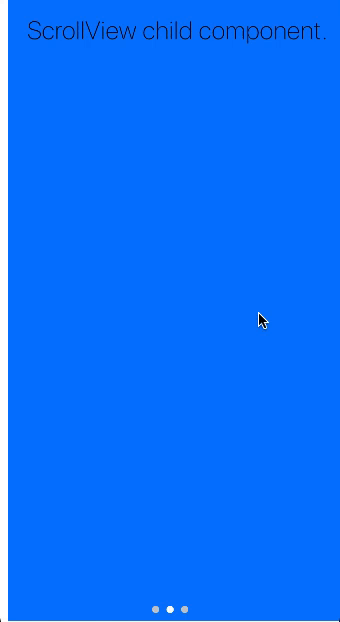

PageControlView swipeable view with PageControls at the bottom of the screen.



Example usage: 
```jsx
<PageControlView defaultPage={1}>
  <View style={styles.container}>
    <Title1>First page.</Title1>
  </View>
  <View style={styles.container}>
    <Title1>Second page.</Title1>
  </View>
  <View style={styles.container}>
    <Title1>Third page.</Title1>
  </View>
</PageControlView>
```

## Theme
[`PageControl`](page-control.html#theme) uses following `theme` properties:
- `barColor` - current page indicator tint color
- `dividerColor` - page indicator tint color

## Props

### `children`  
**type:** `React.Node`  

Children of PageControlView, each one to be displayed as a separate page.

### `containerStyle` (optional)
**type:** `StyleObj`

Style of wrapper container.

### `currentPageIndicatorTintColor` (optional),
**type:** `string`  
**default value:** `barColor` from [`theme`](theme.html)

### `onPageChange` (optional)  
**type:** `number => void`  

Event handler called when current page changes


### `pageIndicatorTintColor` (optional)  
**type:** `string`  
**default value:** `dividerColor` from [`theme`](theme.html)

### `pageIndicatorSize` (optional)  
**type:** `number`  
**default value:** 8

Size of the controls.

### `startPage` (optional)   
**type:**: `number`  
**default value:** `0`  

### `theme` (optional)
**type:** [`Theme`](theme.html)

Custom theme for component. By default provided by the ThemeProvider.
