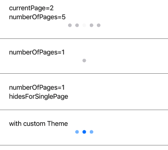

PageControl component shows the position of the current page in a flat list of pages.



Example usage: 
```jsx
<PageControl
  currentPage={currentPage}
  numberOfPages={5}
  updateCurrentPageDisplay={currentPage =>
    this.setState({ currentPage })
  }
/>
```

## Theme
Uses following `theme` properties:
- `barColor` - current page indicator tint color
- `dividerColor` - page indicator tint color

## Props

### `currentPage` 
**type:** `number`  

Selected pages index.

### `currentPageIndicatorTintColor` (optional),
**type:** `string`  
**default value:** `barColor` from [`theme`](theme.html)

### `hidesForSinglePage` (optional)
**type:** `boolean`  
**default value:** `false`

A Boolean value that controls whether the page control is hidden when there is only one page.

### `numberOfPages`
**type:** `number`

The number of pages the receiver shows (as dots).

### `pageIndicatorTintColor` (optional)  
**type:** `string`  
**default value:** `dividerColor` from [`theme`](theme.html)

### `size` (optional)  
**type:** `number`  
**default value:** 8

Size of the controls.

### `theme` (optional)
**type:** [`Theme`](theme.html)

Custom theme for component. By default provided by the ThemeProvider.

### `updateCurrentPageDisplay` 
**type:** `number => void`

Callback function to be fired when user taps controls.
