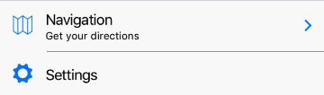

Example usage:
```jsx
<RowItem
  icon="ios-map-outline"
  title="Navigation"
  subtitle="Get your directions"
  rightComponent={ArrowRight}
  onPress={() => alert('Hello')}
/>
```

## Theme
Uses following theme properties:
- `barColor` - background color
- `footnoteColor` - underline color
- `primaryColor` - icon color

## Props

### `theme` (optional)
**type:** [`Theme`](theme.html)

Custom theme for component. By default provided by the ThemeProvider.

### `icon` (optional)
**type:** `string`

Icon name. See ['Icon`](icon.html)

### `title` (optional)
**type:** `string`

Title text to be displayed.

### `subtitle` (optional)
**type:** `string`

Subtitle text to be displayed.

### `rightComponent` (optional)
**type:** `React.Element<*>`

Component to be displayed on the right side of row.

### `onPress` (optional)
**type:** `() => void`

Inveked on RowItem's onPress event.
