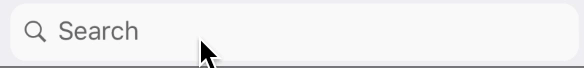

 
Example usage:
```jsx
<SearchBar
  value={this.state.text}
  onChangeText={text => this.setState({ text })}
  withCancel
  animated
/>
```
 
## Props

### `theme` (optional)
**type:** [`Theme`](theme.html)
 
Custom theme for component. By default provided by the ThemeProvider.

### `onChangeText` 
**type:** `(text: string) => void`  

Invoked with the new value when the value of text input changes.

### `placeholder` 
**type:** `string`  
**default value:** `"Search"`

Placeholder of text input. Defaults to "Search".

### `value` 
**type:** `string`  

Value of text input.

### `withCancel` 
**type:** `boolean`  
**default value:** `false`

Indicates presence of Cancel button.  

### `cancelText` 
**type:** `string`  
**default value:** `"Cancel"`

Text of Cancel Button.

### `animated` 
**type:** `boolean`  
**default value:** `false`

Indicates if Cancel button and TextInput should animate on focus/blur.

### `animationTime` 
**type:** `number`  
**default value:** `200`

Animation duration in milliseconds. 

### `onFocus` 
**type:** `() => void`  

Callback invoked on text input focus

### `onBlur` 
**type:** `() => void`  

Callback invoked on text input blur


