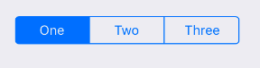

Linear set of two or more segments, each of which functions as a mutually exclusive button. 



Example usage:
```jsx
<SegmentedControl
  values={['One', 'Two', 'Three']}
  selectedIndex={this.state.selectedIndex}
  onChange={index => this.setState({ selectedIndex: index })}
  onValueChange={value =>
    this.setState({
      selectedValue: value,
    })
  }
  style={{ width: 222, alignSelf: 'center' }}
/>
```

## Theme
Uses following `theme` properties:
- `primaryColor` - SegmentedControl's `tintColor` 
## Props

### `onChange`
**type:** `(index: number) => void`

Callback that is called when the user taps a segment.
Passes segments index as an argument

## `onValueChange`
**type:** `(value: string) => void`

Callback that is called when the user taps a segment. 
Passes the segment's value as an argument.

### `selectedIndex`
**type:** `number`

Index of currently selected `value`.

### `theme` (optional)
**type:** [`Theme`](theme.html)

Custom theme for component. By default provided by the ThemeProvider.

### `tintColor` (optional)
**type:** `string`  
**default value:** `theme.primaryColor`

Accent color of SegmentedControl.

### `values`
**type:** `Array<string>`

Labels of the control's segment buttons.

