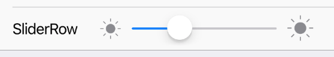

RowItem with Slider on right side.


 
Example usage:
```jsx
<SliderRow
  title="SliderRow"
  onValueChange={sliderValue => this.setState({ sliderValue })}
  value={this.state.sliderValue}
  minIconName="ios-sunny"
  maxIconName="ios-sunny"
/>
```

## Theme
Uses following `theme` properties:
- `placeholderColor` - slider icons color
- `primaryColor` - slider minimum track tint color
- `dividerColor` - slider maximum track tint color
- `barColor` - background color
- `footnoteColor` - row underline color
- `primaryColor` - row icon color

## Props

### [**RowItem props...**](row-item.html#props)

Other props accepted by `RowItem` component.

### [**Slider props...**](slider.html#props)

Other props accepted by `Slider` component.

### `onValueChange`
**type:** `(value: number) => void`  

Invoked with the new value when the value of slider changes.

### `theme` (optional)
**type:** [`Theme`](theme.html)
 
Custom theme for component. By default provided by the ThemeProvider.

### `title`
**type:** `string`

String displayed as a title of TextFieldRow.

### `value`
**type:** `string`

Value of Slider.
