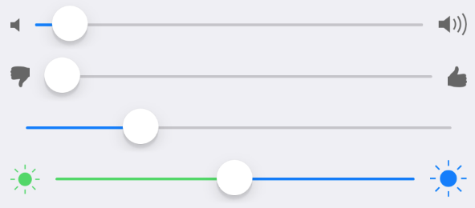

Slider component.



Example usage: 
```jsx
<Slider
  value={this.state.value2}
  onValueChange={value => this.setState({ value2: value })}
  stepValue={5}
  minIconName="ios-thumbs-down"
  maxIconName="ios-thumbs-up"
  minIconSize={20}
  maxIconSize={20}
/>
```

## Theme
Uses following `theme` properties:
- 

## Props

### `style` (optional)
**type:** `Object`

Custom styles to apply to the Icon.

### `theme` (optional)
**type:** [`Theme`](theme.html)

Custom theme for component. By default provided by the ThemeProvider.

