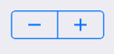

Two-segment control used to increase or decrease an incremental value.



Example usage:
```jsx
<Stepper
  value={this.state.value}
  onChangeCounter={value => this.setState({ value })}
  minValue={0}
  maxValue={10}
/>
```

## Props

### `theme` (optional)
type: [`Theme`](theme.html)

Custom theme for component. By default provided by the ThemeProvider.

### `onChangeCounter`
type: `(counter: number) => void`

Callback function on changing counter result

### `minValue` (optional)
type: `number`

The lowest possible numeric value for the stepper.
Default value is 0.

### `maxValue` (optional)
type: `number`

The highest possible numeric value for the stepper.
The default value of this property is 100.

### `value`
type: `number`

The numeric value of the stepper.

### `step` (optional)
type: `number`
The step, or increment, value for the stepper.
The default value for this property is 1.
