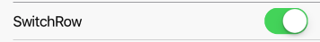

RowItem with Switch button as RightComponent.


 

Example usage:
```jsx
<SwitchRow
  title="SwitchRow"
  value={this.state.switchSelected}
  onValueChange={value => this.setState({ switchSelected: value })}
/>
```

## Props

### [RowItem props...](row-item.html#props)

Other props accepted by `RowItem` component.

### `onValueChange`
**type:** `(value: boolean) => *`

Invoked with the new value when the value changes.

### `theme` (optional)
**type:** [`Theme`](theme.html)
 
Custom theme for component. By default provided by the ThemeProvider.

### `value`
**type** `boolean`

Value of [ToggleButton](toggle-button.html).
