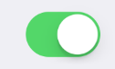

A basic Switch component that should render native ios switch.



Example usage:
```jsx
<Switch
  value={this.state.switchValue}
  onValueChange={value => this.setState({ switchValue: value })}
/>
```

## Theme
Uses following `theme` properties:
- `positiveColor` - selected switch background color (`onTintColor`) 

## Props

### `disabled` (optional)
**type:** `boolean`  

If true, disable all interactions for this component.

### `onValueChange` (optional)
**type:** `(value: boolean) => *`

Invoked with the new value when the value changes.

### `onTintColor` (optional)
**type:** `string`
**default value:** `positiveColor` from [`theme`](theme.html)

Background color when the switch is turned on.

### `style` (optional)
**type:** `Object`  

Switch style.

### `theme` (optional)
**type:** [`Theme`](theme.html)

Custom theme for component. By default provided by the ThemeProvider.

### `thumbTintColor` (optional)
**type:** `string`

Color of the foreground switch grip.

### `tintColor` (optional)
**type:** `string`

Border color when the switch is turned off.

### `value` (optional)
**type:** `boolean`  

Switch value.
