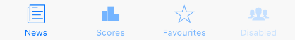

 
Example usage:
```jsx
<TabBar
  tabs={[
    {
      icon: 'ios-paper-outline',
      title: 'News',
      onPress: this.selectTab,
      isActive: this.state.activeTab === 0,
    },
    {
      icon: 'ios-podium',
      title: 'Scores',
      onPress: this.selectTab,
      isActive: this.state.activeTab === 1,
    },
    {
      icon: 'ios-star-outline',
      title: 'Favourites',
      onPress: this.selectTab,
      isActive: this.state.activeTab === 2,
    },
    {
      icon: 'ios-people',
      title: 'Disabled',
      onPress: this.selectTab,
      isActive: this.state.activeTab === 3,
      disabled: true,
    },
  ]}
/>
```
 
## Props

### `theme` (optional)
type: [`Theme`](theme.html)
 
Custom theme for component. By default provided by the ThemeProvider.

### `tabs` 
type: `Array<TabItem>`  

Array of Tabs. Each `TabItem` needs to have below shape:
* `icon`: [Icon name](icon.html)
* `title: string`,
* `onPress: function` to be called when Tab is tapped
* `isActive: boolean`, indicating wheter Tab is active
* `disabled?: boolean`, (optional), diasables a Tab
