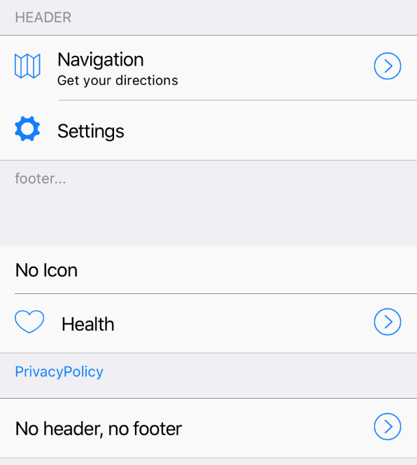

A basic TableView component that can render ios table view.
It renders header, footer and children which can be `RowItem` components  




Example usage:
```jsx
<ScrollView>
  <TableView header="Header" footer="footer...">
    <RowItem
      icon="ios-map-outline"
      title="Navigation"
    />
    <RowItem
      icon="ios-settings"
      title="Settings"
    />
  </TableView>
  <TableView footer="PrivacyPolicy" onFooterPress={() => alert('Hello')}>
    <RowItem title="No Icon" />
  </TableView>
</ScrollView>
```

## Theme

## Props

### `theme` (optional)
**type:** [`Theme`](theme.html)

Custom theme for component. By default provided by the ThemeProvider.

### `header` (optional)
**type:** `string`

Header text of TableView.

### `withoutHeader` (optional)
**type:** `boolean`

Indicates whether render empty header or not. If `true` it won`t render header.

### `headerStyle` (optional)
**type:** `Object`

Custom styles for header.

### `footer` (optional)
**type:** `string`

Footer text of TableView

### `withoutFooter` (optional)
**type:** `boolean`

Whether render empty footer or not. If `true` it won't render footer.

### `footerStyle` (optional)
**type:** `Object`

Custom footer style.

### `onFooterPress` (optional)
**type:** `() => void`

Invoked on footer press. 

### `children`
**type:** `React.ChildrenArray<*>`

Cildren of TableView. Could be [`RowItem`](row-item.html) components.

