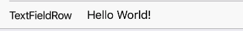

RowItem with TextInput on right side. Useful for inputing small amounts of information.
TextInput focuses on Row press.



Example usage:
```jsx
<TextFieldRow
  title="TextFieldRow"
  value={this.state.textFieldValue}
  onValueChange={text => this.setState({ textFieldValue: text })}
/>
```

## Theme
Uses following `theme` properties:
- `primaryColor` - pointer and selectionColor
- `placeholderColor` - placeholder color  
- `textColor` - text color

## Props

### [RowItem props...](row-item.html#props)

Other props accepted by `RowItem` component.

### `onValueChange`
**type:** `(text: string) => void`  

Invoked with the new value when the value of text input changes.

### `placeholder`  
**type** `string`  

Placeholder value.

### `theme` (optional)
**type:** [`Theme`](theme.html)

Custom theme for component. By default provided by the ThemeProvider.

### `title`
**type:** `string`

String displayed as a title of TextFieldRow.

### `value`
**type:** `string`

Value of TextInput.
