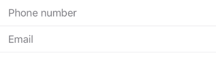

Single-line, fixed-height field, that automatically brings up a keyboard when the user taps it.
Used to request a small amount of information, such as an email address.



Example usage:
```jsx
import { TextField } from 'react-native-ios-kit';

<TextField
  placeholder={'Phone number'}
  value={this.state.phone}
  onValueChange={text => this.setState({ phone: text })}
/>
```

## Theme
Uses following `theme` properties:  
- `backgroundColor` - background color  
- `dividerColor` - color of bottom border  
- `placeholderColor` - placeholder color  
- `primaryColor` - pointer and selectionColor  
- `textColor` - text color

## Props

### [TextInput props...](https://facebook.github.io/react-native/docs/textinput.html#props)

Other props accepted by `TextInput` component.

### `containerStyle` (optional)
**type:** `ViewStyleProp`  

Style of TextField's wrapper container

### `inputStyle` (optional)  
**type:** `ViewStyleProp`  

Style of TextField's input

### `onValueChange`
**type:** `(text: string) => void`  

Invoked with the new value when the value of text input changes.

### `placeholder`  
**type** `string`  

Placeholder value

### `theme`  
**type:** [`Theme`](theme.html)

Custom theme for component. By default provided by the ThemeProvider.

### `value`
**type:** `string`

Value of TextInput

### `clearButton`
**type** `boolean`

Display the custom button to clear the input. By default the button is shown.
