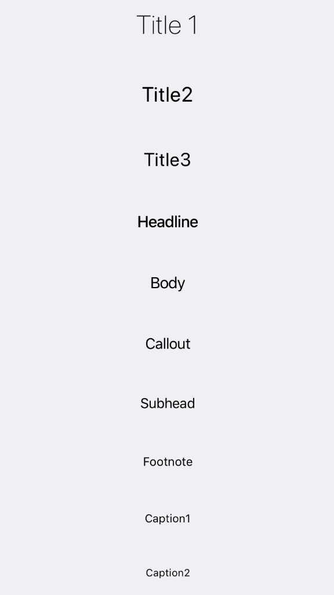

Basic typography components.



Example usage:
```javascript
<Title1>Title 1</Title1>
<Title2>Title2</Title2>
<Title3>Title3</Title3>
<Headline>Headline</Headline>
<Body>Body</Body>
<Callout>Callout</Callout>
<Subhead>Subhead</Subhead>
<Footnote>Footnote</Footnote>
<Caption1>Caption1</Caption1>
<Caption2>Caption2</Caption2>
```

## Typography Components:
 - `Title1`
 - `Title2`
 - `Title3`
 - `Headline`
 - `Body`
 - `Callout`
 - `Subhead`
 - `Footnote`
 - `Caption1`
 - `Caption2`

## Theme
Uses following `theme` properties:
 - `textColor` - color of text

## Props of every typography component

### `style` (optional)
type: `Object`  

Custom styles to apply to the typography component.

### `theme` (optional)
type: [`Theme`](theme.html)

Custom theme for component. By default provided by the ThemeProvider.


